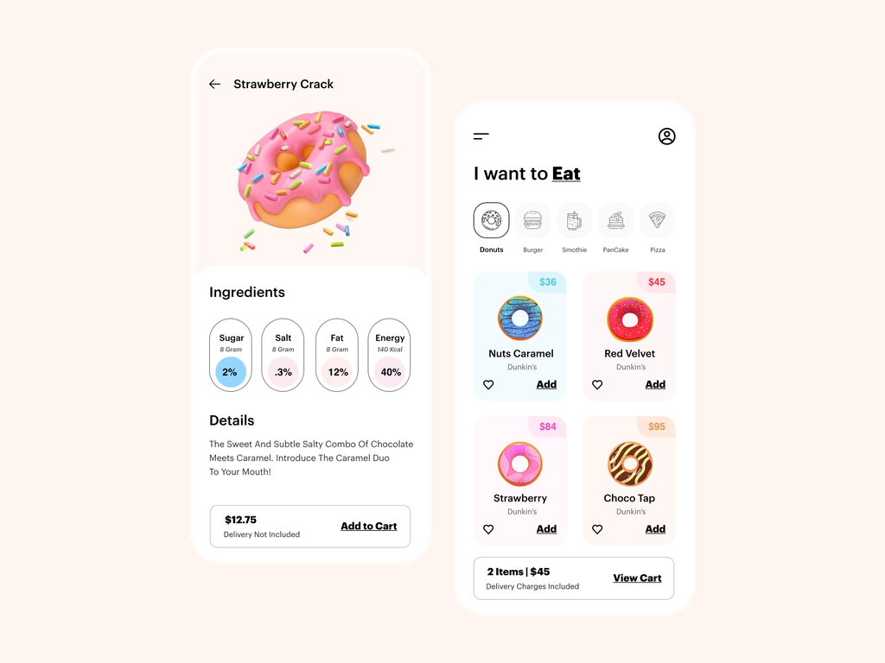

Doughnuts
---

It's an application for dessert store. I try to slicing design from Dribble using SwiftUI 5.7 with dummy data.

Here is the design:

You can try the project on your device.

I hope you enjoy! 🚀

PR is open 😁

-----